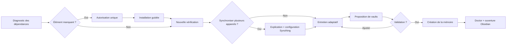

<p align="center">
  
</p>

<p align="center">
  <a href="https://github.com/ncleton-petitmaker/wiki-memory/actions/workflows/ci.yml"></a>
  <a href="https://github.com/ncleton-petitmaker/wiki-memory/releases"></a>
  <a href="LICENSE"></a>
  
</p>

<p align="center">
  Un plugin Codex local-first qui transforme vos sources en mémoire Markdown durable et interrogeable.<br>
  Compatible <a href="https://obsidian.md/">Obsidian</a>, synchronisable avec <a href="https://syncthing.net/">Syncthing</a> et toujours relié aux sources originales.
</p>

<p align="center">
  <a href="#installation-en-deux-commandes"><strong>Installer</strong></a> ·
  <a href="docs/GETTING_STARTED.md">Premiers pas</a> ·
  <a href="docs/ARCHITECTURE.md">Architecture</a> ·
  <a href="docs/CLI_REFERENCE.md">CLI</a> ·
  <a href="README.md">English</a>
</p>

---

## Pourquoi Wiki Memory ?

La couche durable reste volontairement simple : des dossiers, du Markdown, du frontmatter YAML, des wikiliens et les fichiers originaux. La mémoire reste lisible même sans Wiki Memory.

| Principe | Conséquence concrète |
| --- | --- |
| **Local-first** | Les notes, sources, médias et configurations restent dans des dossiers que vous contrôlez. |
| **Sourcé** | Les captures immuables sont séparées du wiki vivant et des synthèses éditables. |
| **Adaptable** | L'onboarding construit les vaults et la taxonomie depuis vos besoins, sans imposer de mémoire client. |
| **Interrogeable** | QMD fournit une recherche exacte, sémantique et hybride entièrement locale. |
| **Portable** | Chaque vault s'ouvre dans Obsidian et la mémoire complète peut être répliquée avec Syncthing. |
| **Auditable** | Chaque fait peut conserver sa source, ses dates réelles, ses dates de mémoire et son historique de remplacement. |

## Installation en deux commandes

```bash
codex plugin marketplace add ncleton-petitmaker/wiki-memory
codex plugin add wiki-memory@petitmaker
```

Redémarrez l'application ChatGPT ou ouvrez Wiki Memory dans une nouvelle tâche Codex. Il est immédiatement utilisable : aucune commande, aucun nom de compétence et aucune phrase technique ne sont à recopier.

Au premier lancement, Wiki Memory s'adresse directement à vous en français :

> Veux-tu démarrer un échange pour que je comprenne mieux tes activités, que je puisse mieux t'aider et que nous structurions ta mémoire ensemble ?

Après votre accord, l'onboarding effectue son diagnostic en lecture seule en arrière-plan. Il ne montre les détails techniques que si une autorisation ou une action de votre part est nécessaire. Il installe ou vérifie alors Python, Node.js, Obsidian, Docling et QMD. Syncthing n'est proposé et installé que si vous souhaitez synchroniser la mémoire avec un autre appareil.

## Ce que fait l'onboarding



Une fois l'installation vérifiée, Wiki Memory demande si vous avez déjà une organisation en tête ou si vous préférez une première proposition fondée sur ce que ChatGPT sait réellement de vous. Cette proposition distingue les faits disponibles, les hypothèses et les informations manquantes.

Il demande aussi si vous souhaitez synchroniser l'installation sur un autre appareil. Cette option est facultative. L'installation possède toujours deux dossiers frères à sa racine : `Agent/` pour l'agent et `Mémoire/` pour vos contenus. Si vous activez Syncthing, l'agent explique son fonctionnement, l'installe avec votre accord, configure ces deux dossiers comme deux partages distincts et vous accompagne jusqu'à leur acceptation sur l'autre appareil.

Les questions portent ensuite sur les objectifs, sources, audiences, frontières confidentielles, livrables, vocabulaire, réseaux sociaux, fréquence de capture, médias, appareils et sauvegardes. Un nouveau vault n'est proposé que si l'objectif, l'audience, le cycle de vie ou la confidentialité le justifient.

## Fonctionnalités

| Domaine | Comportement |
| --- | --- |
| **Onboarding adaptatif** | Conçoit une mémoire multi-vault sans supposer que l'utilisateur gère des clients ou des projets. |
| **Routage explicable** | Réutilise un vault, demande confirmation en cas d'ambiguïté ou justifie l'isolation. |
| **Capture de sources** | Accepte fichiers, URLs et texte collé ; sépare l'original brut de la note normalisée. |
| **Ingestion documentaire** | Utilise [Docling](https://github.com/docling-project/docling) pour la conversion structurée et les formats compatibles OCR. |
| **Recherche locale** | Utilise [QMD](https://github.com/tobi/qmd) pour la recherche exacte, sémantique et hybride. |
| **Mémoire temporelle** | Distingue quand un fait était vrai de quand la mémoire l'a appris, conserve les anciens faits et répond à une date donnée. |
| **Contenus enregistrés** | Collecte assistée par navigateur pour Instagram, LinkedIn, Reddit, X et YouTube, classée par plateforme et collection. |
| **Contrôle qualité** | Détecte liens cassés, sources orphelines, originaux manquants, dates invalides et chaînes de remplacement cassées. |
| **Synchronisation facultative** | Sur demande, configure séparément `Agent/` et `Mémoire/` dans Syncthing et vérifie l'autre appareil, le versioning ou la sauvegarde séparée. |

## Architecture

Chaque installation contient deux dossiers frères. `Agent/` contient Wiki Memory ; `Mémoire/` contient plusieurs vaults indépendants. Les noms internes sont localisables et `vault.yaml` associe toujours les rôles logiques aux dossiers réellement choisis.

```text
racine-installation/
├── Agent/
└── Mémoire/
    ├── memory.config.yaml
    ├── vaults.registry.yaml
    └── connaissances/
        ├── vault.yaml
        ├── 00-Inbox/
        ├── 01-Sources/
        ├── 02-Wiki/
        ├── 03-Syntheses/
        ├── 04-Journal/
        ├── 05-Meta/
        └── 06-Medias/
```

Les modèles, index, environnements Python, paquets Node, sessions navigateur, caches et logs restent hors des vaults synchronisés. Consultez le [guide d'architecture](docs/ARCHITECTURE.md).

Le fonctionnement reste compréhensible sans l'outil :

```text
Source conservée ---> Fait sourcé et daté ---> Réponse vérifiable
                           |
                           +-- c'était vrai quand ?
                           +-- la mémoire l'a appris quand ?

Ancien fait conservé ---> Nouveau fait courant
```

Un fait qui change n'est jamais effacé silencieusement. L'ancienne note indique jusqu'à quand elle était vraie et pointe vers son remplacement. Si la source ne fournit aucune date, Wiki Memory laisse la date vide et affiche une question ouverte plutôt que d'inventer.

Lors de l'activation des réseaux sociaux, l'agent explique l'intérêt et les limites du scan, vérifie les dépendances, demande les plateformes, collections, dossiers de destination et règles média, puis ouvre le navigateur Codex pour une connexion interactive. Après un premier test, il propose une synchronisation manuelle, quotidienne, hebdomadaire ou personnalisée avec heure, fuseau et destination du compte rendu. Les identifiants ne sont jamais demandés dans la conversation ni copiés dans la mémoire.

## Vie privée et sécurité

- Aucun service de mémoire hébergé et aucune télémétrie.
- Aucun cookie, profil navigateur, mot de passe ou état d'authentification copié.
- Uniquement des fixtures synthétiques dans le dépôt.
- Arrêt explicite face aux captchas, contrôles, limites ou changements d'interface.
- CI sur macOS, Linux et Windows, analyse de secrets et détection des chemins personnels.

Syncthing synchronise mais ne remplace pas une sauvegarde. Activez le versioning sur au moins un appareil ou maintenez une sauvegarde séparée.

## Documentation

- [Premiers pas](docs/GETTING_STARTED.md)
- [Architecture](docs/ARCHITECTURE.md)
- [Référence CLI](docs/CLI_REFERENCE.md)
- [Obsidian et Syncthing](docs/OBSIDIAN_AND_SYNCTHING.md)
- [Connecteurs sociaux](docs/SOCIAL_CONNECTORS.md)
- [Dépannage](docs/TROUBLESHOOTING.md)
- [Choix open source](docs/OPEN_SOURCE_DECISIONS.md)

## Contribuer

Consultez [CONTRIBUTING.md](CONTRIBUTING.md). Toutes les fixtures doivent rester synthétiques et la commande `python3 scripts/privacy_scan.py .` doit réussir avant une pull request.

Wiki Memory est distribué sous [licence MIT](LICENSE). Questions et idées : [GitHub Discussions](https://github.com/ncleton-petitmaker/wiki-memory/discussions).
