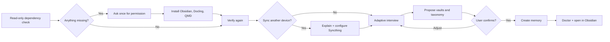

<p align="center">
  
</p>

<p align="center">
  <a href="https://github.com/ncleton-petitmaker/wiki-memory/actions/workflows/ci.yml"></a>
  <a href="https://github.com/ncleton-petitmaker/wiki-memory/releases"></a>
  <a href="LICENSE"></a>
  <a href="https://www.python.org/"></a>
  
</p>

<p align="center">
  A local-first Codex plugin that turns sources into a durable, searchable Markdown memory.<br>
  Built for <a href="https://obsidian.md/">Obsidian</a>. Safe to sync with <a href="https://syncthing.net/">Syncthing</a>. Grounded in original sources.
</p>

<p align="center">
  <a href="#install-in-two-commands"><strong>Install</strong></a> ·
  <a href="docs/GETTING_STARTED.md">Getting started</a> ·
  <a href="docs/ARCHITECTURE.md">Architecture</a> ·
  <a href="docs/CLI_REFERENCE.md">CLI</a> ·
  <a href="README.fr.md">Français</a>
</p>

---

## Why Wiki Memory?

Most knowledge tools make you choose between convenience and ownership. Wiki Memory keeps the durable layer boring on purpose: folders, Markdown, YAML frontmatter, wikilinks, and original files that remain readable without Wiki Memory.

| Principle | What it means in practice |
| --- | --- |
| **Local first** | Notes, originals, media, and configuration live in folders you control. |
| **Source grounded** | Immutable source captures stay separate from editable wiki notes and syntheses. |
| **Adaptable** | Onboarding designs vault boundaries and taxonomy from the user's needs—no client structure by default. |
| **Searchable** | QMD provides exact, semantic, and hybrid retrieval without sending the memory to a hosted vector database. |
| **Portable** | Obsidian opens every vault; Syncthing can mirror the complete memory across devices. |
| **Auditable** | Hashes, canonical URLs, revisions, epistemic status, broken links, orphans, and contradictions remain inspectable. |

## Install in two commands

```bash
codex plugin marketplace add ncleton-petitmaker/wiki-memory
codex plugin add wiki-memory@petitmaker
```

Restart the ChatGPT desktop app or open Wiki Memory in a new Codex task. No command, skill name, or technical prompt needs to be copied.

On first launch, Wiki Memory directly greets the user in French:

> Veux-tu démarrer un échange pour que je comprenne mieux tes activités, que je puisse mieux t'aider et que nous structurions ta mémoire ensemble ?

After the user agrees, onboarding runs its read-only dependency check in the background. Technical details are surfaced only when permission or user action is needed.

> [!NOTE]
> Python 3.10+ is the only prerequisite needed to launch the bootstrap. If Python is missing, onboarding starts there.

## What onboarding does



After installation is verified, Wiki Memory asks whether the user already has an organization in mind or wants an initial proposal grounded in what ChatGPT genuinely knows about them. The proposal separates available facts, assumptions, and missing information.

It also asks whether the user wants to synchronize the installation to another device. This is optional. Every installation has two root-level sibling folders: `Agent/` for the agent and `Mémoire/` for user content. When enabled, the agent explains Syncthing, installs it with permission, configures these as two separate shares, and helps complete acceptance on the other device.

The interview then covers goals, sources, audiences, confidentiality boundaries, expected outputs, terminology, social collections, capture frequency, media policy, devices, and backup strategy. A new vault is created only when purpose, audience, lifecycle, or confidentiality justify it.

## Capabilities

| Area | Included behavior |
| --- | --- |
| **Adaptive onboarding** | Designs a personalized multi-vault memory without assuming clients, projects, or social media. |
| **Smart routing** | Reuses an existing vault, asks on ambiguity, or explains why isolation is required. |
| **Source capture** | Accepts files, URLs, and pasted text; preserves raw material and normalized source notes separately. |
| **Document ingestion** | Uses [Docling](https://github.com/docling-project/docling) for structured Markdown conversion and OCR-capable formats. |
| **Local search** | Uses [QMD](https://github.com/tobi/qmd) for exact, semantic, and hybrid retrieval with source paths. |
| **Social saves** | Browser-assisted collection for Instagram, LinkedIn, Reddit, X, and selected YouTube playlists, filed by platform and collection. |
| **Quality control** | Detects broken wikilinks, ambiguous links, missing raw files, orphaned sources, and invalid frontmatter. |
| **Optional synchronization** | On request, configures `Agent/` and `Mémoire/` separately in Syncthing and verifies the other device, versioning, or separate backup readiness. |
| **Interoperability** | Imports normalized social captures and Karakeep JSON exports without changing the source of truth. |

## Architecture

Every installation has two sibling directories. `Agent/` contains Wiki Memory; `Mémoire/` contains independent vaults. Internal folder names are localizable; scripts resolve logical roles through `vault.yaml` rather than hard-coded translations.

```text
installation-root/
├── Agent/                       # Public Wiki Memory agent
└── Mémoire/                      # Personal memory root
    ├── memory.config.yaml
    ├── vaults.registry.yaml
    └── knowledge/               # One independent Obsidian vault
        ├── vault.yaml
        ├── 00-Inbox/
        ├── 01-Sources/
        ├── 02-Wiki/
        ├── 03-Syntheses/
        ├── 04-Journal/
        ├── 05-Meta/
        └── 06-Medias/
```

Models, indexes, Python environments, Node packages, browser state, caches, and logs stay in the operating system's user-data directory—not in synchronized vaults. See the full [architecture guide](docs/ARCHITECTURE.md).

When social sources are enabled, the agent explains the benefits and limits, verifies dependencies, asks for platforms, collections, destination folders, and media rules, then opens the controlled Codex browser for interactive sign-in. After a successful test sync, it offers manual, daily, weekly, or custom scheduling with a local time, timezone, and report destination. Credentials are never requested in chat or copied into the memory.

## Eight agent workflows

| Skill | Use it to… |
| --- | --- |
| `$wiki-memory-onboarding` | install dependencies and design a memory |
| `$wiki-memory-router` | decide where new knowledge belongs |
| `$wiki-memory-capture` | preserve a source without losing provenance |
| `$wiki-memory-ingest` | convert a document or page into structured Markdown |
| `$wiki-memory-query` | answer from the memory with traceable sources |
| `$wiki-memory-social-sync` | collect saved social items through a controlled browser |
| `$wiki-memory-lint` | find structural and knowledge-quality problems |
| `$wiki-memory-doctor` | diagnose installation, vault, search, and sync health |

## Social collection is deliberately conservative

Wiki Memory uses the browser session controlled by the user. It never copies cookies, profiles, passwords, local storage, or authentication state. A run stops explicitly on login requirements, captchas, verification flows, rate limits, access denial, or an unsupported page layout.

Supported targets are Instagram saved items and collections, LinkedIn saved posts, Reddit saved items, X bookmarks, and user-selected YouTube playlists. See [social connector behavior](docs/SOCIAL_CONNECTORS.md).

## Trust and privacy

- No telemetry and no hosted memory service.
- No secrets, browser sessions, or personal fixtures in this repository.
- Synthetic test data only.
- Original sources are not rewritten to make claims cleaner.
- Facts, inferences, open questions, and unverified claims can be distinguished explicitly.
- CI scans for secrets, personal paths, unsafe fixtures, and regressions on macOS, Linux, and Windows.

Syncthing is synchronization, not backup. Enable file versioning on at least one device or maintain a separate backup. Read the [security policy](SECURITY.md) and [Obsidian/Syncthing guide](docs/OBSIDIAN_AND_SYNCTHING.md).

## Documentation

| Guide | Purpose |
| --- | --- |
| [Getting started](docs/GETTING_STARTED.md) | Installation, first onboarding, and first source |
| [Architecture](docs/ARCHITECTURE.md) | Memory container, vault roles, routing, and data flow |
| [CLI reference](docs/CLI_REFERENCE.md) | Commands, flags, and examples |
| [Obsidian & Syncthing](docs/OBSIDIAN_AND_SYNCTHING.md) | Cross-device setup and ignore policy |
| [Social connectors](docs/SOCIAL_CONNECTORS.md) | Supported targets and typed stop states |
| [Troubleshooting](docs/TROUBLESHOOTING.md) | Dependency, indexing, browser, and sync recovery |
| [Open-source decisions](docs/OPEN_SOURCE_DECISIONS.md) | Why Docling, QMD, and Markdown are the core |

## Development

```bash
git clone https://github.com/ncleton-petitmaker/wiki-memory.git
cd wiki-memory
python3 -m unittest discover -s tests -v
python3 scripts/privacy_scan.py .
```

On Windows, use `py -3` in place of `python3`. Read [CONTRIBUTING.md](CONTRIBUTING.md) before opening a pull request. Fixtures must remain synthetic.

## Project status

Wiki Memory is usable and tested, but still pre-1.0. File formats are designed to remain human-readable and migration-friendly while the CLI and plugin surface evolve. See [CHANGELOG.md](CHANGELOG.md) for release notes.

## Community and license

Questions and ideas belong in [GitHub Discussions](https://github.com/ncleton-petitmaker/wiki-memory/discussions). Reproducible bugs and scoped features belong in [Issues](https://github.com/ncleton-petitmaker/wiki-memory/issues). Security reports must follow [SECURITY.md](SECURITY.md).

Released under the [MIT License](LICENSE). Built by [Petitmaker](https://github.com/ncleton-petitmaker), with ideas inspired by the open-source projects documented in [OPEN_SOURCE_DECISIONS.md](docs/OPEN_SOURCE_DECISIONS.md).
