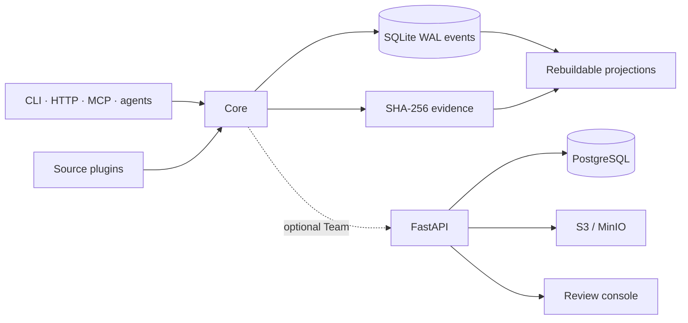

# Architecture V1

## Boundaries

Core owns only plugin lifecycle, the append-only ledger, content-addressed evidence, projection checkpoints, the event bus, and minimal CLI/API surfaces. Markdown, QMD, Docling, social capture, audio, PostgreSQL, Syncthing, MCP, backup, and Team are plugins or plugin-facing services.



GitHub carries code, schemas, CI, signed artifacts, and a catalog. It never carries user memory. Runtime caches, QMD indexes, browser state, credentials, models, and temporary media remain outside the memory root. The durable solo ledger and evidence live under `Mémoire/.wiki-memory/data/` because they are user data, not runtime cache.

The cached Team entitlement session is device-local authorization state, not memory. It also stays in the OS runtime directory and is excluded from backup and Syncthing; restoring shared projections on another device therefore exposes nothing until that device authenticates.

## Write path

1. A connector computes stable source identity/version and emits a protocol message.
2. Core writes the evidence to a same-filesystem temporary file, flushes it, verifies SHA-256, atomically renames it, and fsyncs the containing directory.
3. Core validates UUIDv7, timestamps, ACL, evidence references, idempotency, and expected stream version.
4. SQLite executes `BEGIN IMMEDIATE`, assigns the next stream version, inserts the immutable event, optionally inserts its outbox row in the same transaction, and commits with WAL plus `synchronous=FULL`.
5. Only then does the projector advance. A projection failure is persisted as operational state and does not revoke the durable event acknowledgement.

Database triggers reject updates and deletes from `events`. Corrections, tombstones, review decisions, retractions, and supersessions are later events. An orphan blob is safe after a crash; a committed event pointing to an absent blob is not allowed.

## Event and source contracts

The executable schemas are:

- `schemas/memory-event.schema.json`;
- `schemas/access-policy.schema.json`;
- `schemas/source-message.schema.json`;
- `schemas/plugin-manifest.schema.json`.

Source delivery is at least once. A checkpoint is committed only after all earlier messages have durable events and evidence. Idempotency combines connector instance, source identity, source version, and content hash. Reusing the same idempotency key for different semantic content is rejected rather than silently deduplicated.

`occurredAt` describes the source world; `recordedAt` describes when memory learned it. Missing real dates remain `null`. Extracted facts are proposals and retain exact extractor plugin/version plus evidence. A human-authored procedural memory is the only accepted assertion allowed without evidence.

## Projection rules

Each projector owns a checkpoint and plugin version. A version change requires a rebuild; history is never rewritten. Markdown writes use a temporary file, fsync, and atomic rename. Generated file hashes are recorded in the rebuildable `.wiki-memory/projections/markdown-generated.sqlite3` state index; it uses per-file atomic upserts so a large vault never rewrites an ever-growing manifest on every capture. QMD defaults to deterministic local BM25 retrieval; model-backed query expansion/reranking is never silently downloaded or required for an everyday search.

When a generated file changes outside the projector:

1. the projector stops replacing that path and writes new generated output under `projections/pending`;
2. `wiki-memory markdown-edits` preserves the human file as evidence and creates `projection.edit.proposed`;
3. solo review accepts or rejects it; shared edits require a Team curator;
4. an accepted edit replays as `projection.edit.accepted`, so a full rebuild reproduces it exactly.

Normal rebuild refuses unreviewed edits. `--force` is an explicit destructive override intended for a reviewed rejection or operator recovery.

## Plugin lifecycle and trust

The loader resolves capability dependencies, validates configuration without executing plugin code, and reports missing services as `PENDING`. Each acquisition registers a cleanup; failed startup unwinds in reverse order. Production update semantics are drain-and-restart, not hot reload.

Bundled trusted Python plugins may run in process. An unknown Python plugin is quarantined unless solo developer mode is explicit. A `signature` field alone is never trusted: Team requires catalog trust or a real verifier callback. Executable and OCI plugins use a separate NDJSON host and expose only capability-scoped RPC facades; they never receive Core objects. OCI images must be digest-pinned and run read-only with dropped Linux capabilities and no network unless declared. An executable process is isolation from Core, not a claim of OS sandboxing.

This last boundary is intentionally fail-closed. The alpha does not claim that a Python interpreter can sandbox hostile Python.

## Solo storage

```text
Mémoire/
├── memory.config.yaml
├── vaults.registry.yaml
├── .wiki-memory/
│   ├── data/
│   │   ├── events.sqlite3
│   │   ├── blobs/sha256/aa/bb/<digest>
│   │   └── exports/<producer>/<immutable-pack>.json
│   └── projections/markdown-generated.sqlite3
└── <vault>/
    ├── 01-Sources/       # projection
    ├── 02-Wiki/          # projection / reviewed human edits
    └── ...
```

Syncthing points at `.wiki-memory/data`, excludes SQLite and outbox state, and transports only blobs plus immutable packs. Each receiving device imports packs idempotently and rebuilds its own Markdown and indexes.

## Team authorization and replication

Scopes are `private`, `team`, and `organization`. Private events are rejected by the server. An ACL has owners, readers, groups, spaces, classification, and an audience of `explicit`, `space`, or `organization`. Derived ACLs intersect readers/groups/spaces and retain the most restrictive classification. Search first limits candidate spaces, then applies the exact ACL before returning a result. Blob GET performs the same check through referencing events.

A content hash is not an authorization capability. When an uploaded Team event
reuses a blob already referenced by canonical events, the server first requires
authorized provenance and derives the destination ACL from it. A guessed hash
cannot be attached to a new event, and a member who can read an object cannot
republish it into a space absent from its provenance ACL.

An organization publication is two distinct events: a Team-scoped
`source.publication.proposed` containing a deferred, normalized organization
target, then a curator-created `source.published` event. The accepted event
starts a new organization stream (version 1) and keeps the proposal as its
causation: an organization reader is not entitled to receive the Team-scoped
proposal, so a continued stream would be impossible to replay safely. The
proposed event and its blob remain unreadable outside the Team space; only
acceptance applies the organization ACL. A proposal is neither a hidden search result nor an early
organization disclosure.

The client uploads absent blobs, then outbox events with their exact positive `streamVersion`. PostgreSQL serializes each stream with `pg_advisory_xact_lock`. A stale write creates an ACL-preserving conflict proposal. The client marks the outbox row rejected-for-review; it never reports successful synchronization.

After push, the client pulls by durable cursor. It downloads and verifies every missing blob before inserting the event. Unauthorized server events still advance the global cursor so a filtered row cannot trap a client forever.

## Team persistence and workers

PostgreSQL stores events, audit records, jobs, and the current search projection. Event insert and job enqueue share a transaction. Workers claim jobs using `FOR UPDATE SKIP LOCKED`, retry with bounded exponential delay, and dead-letter after five failures. Search projection deletion follows source tombstones and assertion retractions; canonical events remain. An admin can atomically rebuild Team search entirely from canonical events; the PITR verifier re-runs that rebuild, checks event hashes/contiguous streams, and verifies referenced object bytes before an aggregate restore attestation is accepted.

Object storage is content addressed and verifies every upload and retrieval before it is considered usable evidence. MinIO versioning is enabled by the Compose initialization job. Production must provide PostgreSQL PITR and continuously tested restoration; the application does not pretend that a `pg_dump` is PITR.

## Decisions deliberately excluded

- No canonical graph: it may become a rebuildable projection after measured retrieval gain.
- No semantic CRDT: stale knowledge edits become proposals.
- No live arbitrary SQL tool attached to ingestion credentials.
- No automatic organization publication or hidden ACL widening.
- No cloud transcription by default.
- No synchronization of active SQLite.
