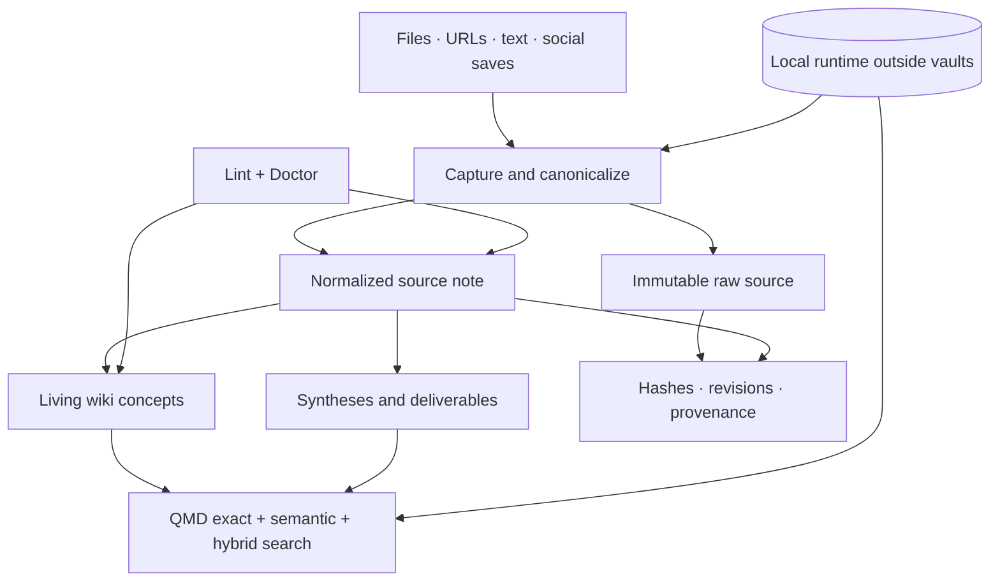

# Architecture

Wiki Memory separates durable knowledge from reproducible runtime state. Markdown and original files are the source of truth; indexes, models, browser state, and caches are disposable.

## System overview

## Installation and memory container

Each durable installation root contains exactly two sibling directories:

- `Agent/`: the public Wiki Memory plugin files;
- `Mémoire/`: global memory configuration and one or more independent vaults.

The `Mémoire/` container holds:

- `memory.config.yaml`: language, registered vaults, connectors, schedules, and sync policy;
- `vaults.registry.yaml`: vault paths and routing decisions;
- `AGENTS.md`: generic agent behavior for the memory;
- `WIKI.md`: the generated architecture contract;
- `syncthing.ignore.template`: shared ignore policy, created only when synchronization is enabled;
- `.stignore`: local Syncthing copy, created and verified only on enabled devices;
- one directory per vault.

The container itself is not necessarily an Obsidian vault. Each registered vault can be opened independently. When synchronization is enabled, `Agent/` and `Mémoire/` are two separate Syncthing folders. Runtime and credential state remain outside both.

## Vault roles

`vault.yaml` maps logical roles to the actual localized directory names. Scripts use the role, never a hard-coded translated path.

| Role | Responsibility | Mutability |
| --- | --- | --- |
| `inbox` | unprocessed captures | temporary |
| `sources` | originals, raw captures, normalized source notes, revisions | append-only |
| `wiki` | concepts, entities, claims, and links | refactorable |
| `outputs` | syntheses and deliverables | editable |
| `journal` | chronological activity | append-oriented |
| `meta` | gaps, contradictions, orphan reports, quality state | generated/editable |
| `assets` | media referenced by Markdown | stable |

## Source lifecycle

1. Canonicalize the URL or identify the file origin.
2. Hash the content.
3. Preserve the raw capture and original file.
4. Create a normalized Markdown source note with frontmatter.
5. Treat matching URL and hash as a duplicate.
6. Preserve a significant new hash as a revision.
7. Build or update wiki notes separately.
8. Refresh QMD outside the vault.

Source notes are evidence. They are not rewritten to make a later conclusion look cleaner.

## Epistemic status

Knowledge can be marked as:

- `fact`: directly supported by available evidence;
- `inference`: reasoned from evidence but not directly stated;
- `open_question`: unresolved and worth investigating;
- `unverified`: captured but not validated.

These labels describe epistemic status, not importance.

## Vault boundary algorithm

The router compares four dimensions:

1. purpose;
2. audience;
3. lifecycle;
4. confidentiality.

A topic difference alone normally changes taxonomy, not the vault. A distinct confidentiality boundary is the strongest reason to isolate knowledge. When multiple vaults rank similarly, the router asks instead of guessing.

## Runtime isolation

The runtime directory follows operating-system conventions:

- macOS: `~/Library/Application Support/WikiMemory`;
- Windows: `%LOCALAPPDATA%\WikiMemory`;
- Linux: `$XDG_DATA_HOME/wiki-memory` or `~/.local/share/wiki-memory`.

It contains the Python environment, Docling, QMD, optional portable Node.js, models, indexes, and per-memory runtime state. None of it should be synchronized or committed.

## Threat boundaries

- Browser credentials and cookies are outside scope and never copied.
- Paths are constrained to the selected memory root for memory writes.
- Social capture fails closed on access controls.
- Git and Syncthing exclusions cover secrets and reproducible state.
- The privacy scanner rejects likely secrets, browser tokens, and personal absolute paths.

See [SECURITY.md](../SECURITY.md) for reporting and supported versions.
