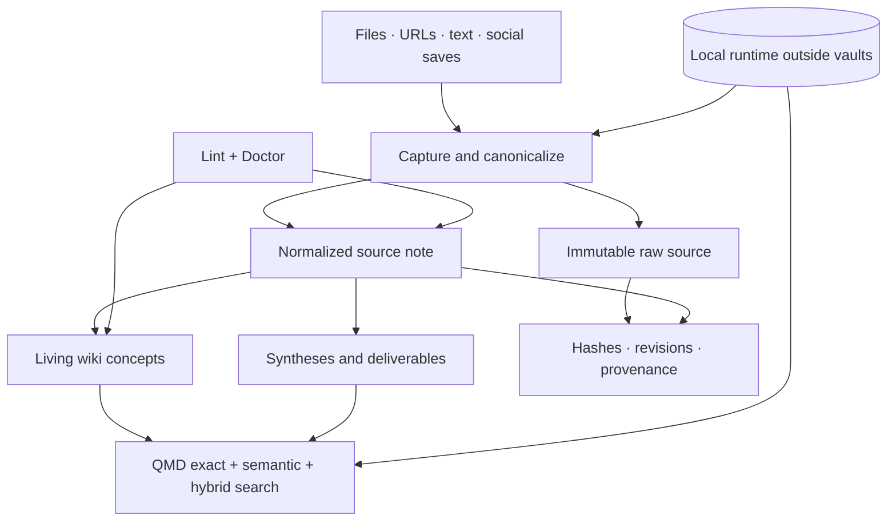

# Architecture

Wiki Memory separates durable knowledge from reproducible runtime state. Markdown and original files are the source of truth; indexes, models, browser state, and caches are disposable.

## System overview



## Installation and memory container

Each durable installation root contains exactly two sibling directories:

- `Agent/`: the public Wiki Memory plugin files;
- `Mémoire/`: global memory configuration and one or more independent vaults.

The `Mémoire/` container holds:

- `memory.config.yaml`: language, registered vaults, connectors, schedules, and sync policy;
- `vaults.registry.yaml`: vault paths and routing decisions;
- `AGENTS.md`: generic agent behavior for the memory;
- `WIKI.md`: the generated architecture contract;
- `syncthing.ignore.template`: shared ignore policy, created only when synchronization is enabled;
- `.stignore`: local Syncthing copy, created and verified only on enabled devices;
- one directory per vault.

The container itself is not necessarily an Obsidian vault. Each registered vault can be opened independently. When synchronization is enabled, `Agent/` and `Mémoire/` are two separate Syncthing folders. Runtime and credential state remain outside both.

## Vault roles

`vault.yaml` maps logical roles to the actual localized directory names. Scripts use the role, never a hard-coded translated path.

| Role | Responsibility | Mutability |
| --- | --- | --- |
| `inbox` | unprocessed captures | temporary |
| `sources` | originals, raw captures, normalized source notes, revisions | append-only |
| `wiki` | concepts, entities, claims, and links | refactorable |
| `outputs` | syntheses and deliverables | editable |
| `journal` | chronological activity | append-oriented |
| `meta` | gaps, contradictions, orphan reports, quality state | generated/editable |
| `assets` | media referenced by Markdown | stable |

## Source lifecycle

1. Canonicalize the URL or identify the file origin.
2. Hash the content.
3. Preserve the raw capture and original file.
4. Create a normalized Markdown source note with frontmatter.
5. Treat matching URL and hash as a duplicate.
6. Preserve a significant new hash as a revision.
7. Build or update wiki notes separately.
8. Refresh QMD outside the vault.

Source notes are evidence. They are not rewritten to make a later conclusion look cleaner.

## Bi-temporal facts

Wiki notes and syntheses can describe one version of a fact on two independent timelines:

| Frontmatter field | Timeline | Meaning |
| --- | --- | --- |
| `valid_from` | world | when the fact became true in reality |
| `valid_until` | world | when the fact stopped being true in reality |
| `recorded_at` | system | when the memory learned the fact |
| `invalidated_at` | system | when the memory learned that the fact was no longer current |
| `supersedes` | history | relative wikilink from the replacement to the older fact |
| `superseded_by` | history | relative wikilink from the older fact to its replacement |

All six fields are optional so existing vaults remain readable and valid. World time accepts an ISO 8601 date or timestamp. System time uses an RFC 3339 UTC timestamp. Time intervals are half-open: a fact is active from its start, inclusive, until its end, exclusive.

The temporal unit is a Markdown note. Keep Wiki fact notes focused enough that one validity interval describes the note. A synthesis is versioned as a whole; if parts of it have different lifecycles, move those claims into focused Wiki notes and cite them from the synthesis.

Example:

```yaml
---
epistemic_status: fact
valid_from: 2026-04-01
valid_until: null
recorded_at: 2026-04-03T09:20:00Z
invalidated_at: null
supersedes: "[[offer-before-april-2026]]"
superseded_by: null
---
```

When ingesting a source, a date explicitly attached to the fact takes priority. Otherwise the fact inherits an explicit publication, meeting, or sent date from the source. Capture time, filesystem time, and the current clock must never be substituted for a missing world date. If the source supplies no date, `valid_from` remains null and the temporal gap is recorded as an open question.

Replacing a fact never deletes or rewrites its body. The newer fact points to the older fact with `supersedes`. Once the replacement is confirmed, the older fact receives `valid_until`, `invalidated_at`, and `superseded_by`. Only this lifecycle frontmatter may be completed; files in the Sources role remain untouched.

When two contradictory facts have comparable `valid_from` values, the later world-time fact is current even if it was ingested first. If the order is missing or ambiguous, lint can present the alternatives but must not choose or apply one without user confirmation.

Queries use current facts by default. A system-time snapshot answers what the memory knew at a date using `recorded_at` and `invalidated_at`. A world-time snapshot answers what was true at a date using `valid_from` and `valid_until`. Results retain source citations and report stale or undated facts excluded by the selected view.

## Epistemic status

Knowledge can be marked as:

- `fact`: directly supported by available evidence;
- `inference`: reasoned from evidence but not directly stated;
- `open_question`: unresolved and worth investigating;
- `unverified`: captured but not validated.

These labels describe epistemic status, not importance.

## Vault boundary algorithm

The router compares four dimensions:

1. purpose;
2. audience;
3. lifecycle;
4. confidentiality.

A topic difference alone normally changes taxonomy, not the vault. A distinct confidentiality boundary is the strongest reason to isolate knowledge. When multiple vaults rank similarly, the router asks instead of guessing.

## Runtime isolation

The runtime directory follows operating-system conventions:

- macOS: `~/Library/Application Support/WikiMemory`;
- Windows: `%LOCALAPPDATA%\WikiMemory`;
- Linux: `$XDG_DATA_HOME/wiki-memory` or `~/.local/share/wiki-memory`.

It contains the Python environment, Docling, QMD, optional portable Node.js, models, indexes, and per-memory runtime state. None of it should be synchronized or committed.

## Threat boundaries

- Browser credentials and cookies are outside scope and never copied.
- Paths are constrained to the selected memory root for memory writes.
- Social capture fails closed on access controls.
- Git and Syncthing exclusions cover secrets and reproducible state.
- The privacy scanner rejects likely secrets, browser tokens, and personal absolute paths.

See [SECURITY.md](../SECURITY.md) for reporting and supported versions.
